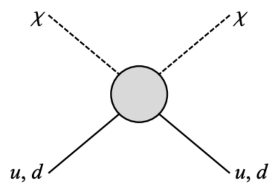

# BoostedDM

> There is a common issue with all direct detection experiments in that they lose sensitivity to light dark matter due to small nuclear recoils. We estimated the impact that inelastic collisions of cosmic rays in the atmosphere, producing light dark matter from meson decays, could have on the direct detection parameter space.
### Light Dark Matter from Inelastic Cosmic Ray Collisions, *J. Alvey, M. Campos, M. Fairbairn, T. You*

This repository is relevant to an article written in May 2019 with colleagues at King's College London and the University of Cambridge. Links to the webpages and PDF documents can be found below. Also included is a link to a presentation given by myself at the recent BUSSTEPP Summer School at the University of Glasgow.

### Light Dark Matter from Inelastic Cosmic Ray Collisions, *J. Alvey, M. Campos, M. Fairbairn, T. You*

*Abstract:* Direct detection experiments relying on nuclear recoil signatures lose sensitivity to sub-GeV dark matter for typical galactic velocities. This sensitivity is recovered if there exists another source of flux with higher momenta. Such an energetic flux of light dark matter could originate from the decay of mesons produced in inelastic cosmic ray collisions. We compute this novel production mechanism - a cosmic beam dump experiment - and estimate the resulting limits from XENON1T and LZ. We find that the dark matter flux from inelastic cosmic rays colliding with atmospheric nuclei can dominate over the flux from elastic collisions with relic dark matter. The limits that we obtain for hadrophilic scalar mediator models are competitive with those from MiniBoone for light MeV-scale mediator masses.

* <a href="https://arxiv.org/pdf/1905.05776.pdf" target="blank_"><i class="fa fa-file-pdf-o" aria-hidden="true"></i> PDF</a> 

* <a href="http://inspirehep.net/record/1735134" target="blank_"><i class="fa fa-external-link" aria-hidden="true"></i> Inspire-HEP Record</a>

* <a href="https://james-alvey-42.github.io/assets/pdf/beam-dump.pdf" target="blank_"><i class="fa fa-file-pdf-o" aria-hidden="true"></i> BUSSTEPP Presentation</a>

* <a href="https://www.kcl.ac.uk/news/changing-the-way-we-search-for-dark-matter" target="blank_"><i class="fa fa-rss" aria-hidden="true"></i> KCL News Appearance</a>

## Direct Detection

There are a couple of ways we might think about trying to deduce the existence of (particle) dark matter. This is well illustrated by the following diagram;

We can view this in a couple of ways:

1. **Top to Bottom** - Indirect Detection e.g. X-ray background, annihilation of DM into standard model particles
2. **Bottom to Top** - Production e.g. proton-proton collisions at the LHC leading to msising energy etc.
3. **Left to Right** - Direct Detection e.g. nuclear recoils

It is of course the latter case we are interested in here. To "directly detect" dark matter, we generically look for recoils of nuclei in elastic collisions with DM particles. To see why this is an issue for light dark matter, consider the following analogy. Imagine that the nucleus is a bowling ball of sorts. Then heavy dark matter will be of similar bowling ball type. When a collision occurs between these two objects, the nucleus will move a significant amount. On the other hand, light dark matter is akin to a golf ball being thrown at the bowling ball. In this case, the golf ball will simply rebound and it will be difficult to see the bowling ball move.

This also helps us understand how boosting the momentum of the light dark matter can overcome this sensitivity issue. If we throw the golf ball hard enough, then despite its low mass, we may still be able to see the bowling ball recoil. This is the intuition for our novel production mechanism in the boosted decay of mesons in the atmosphere.

## Traditional Beam Dump Experiments

In traditional beam dump experiments such as MiniBooNe (located at Fermilab, IL) a high energy proton beam from some accelerator is directed at a dense fixed target. This leads to a significant number of collisions and is potentially an efficient production mechanism for dark matter particles. If a detector is placed downstream of this production point then there is the potential to overcome the light dark matter issue discussed above since any that is produced will be highly boosted.

## The Atmosphere as a Beam Dump

To understand how the atmosphere can act as a beam dump, we make some analogies between the different aspects described above.

1. **Proton Beam** - This is replaced by the flux of cosmic rays coming from both galactic and extra-galactic sources.
2. **Fixed Target** - Instead of the steel target in MiniBooNe, the nitrogen molecules in the atmosphere act as a fixed target for the cosmic rays.
3. **Detector** - Direct detection benefits from a large detector size, and due to the atmospheric nature, we can utitlise any Earth based detector such as Xenon-1T to act as the endpoint of the beam dump. This is in contrast to the dedicated detector that needs to be present at MiniBooNe.

{:width="500px"}

## Conclusions: How does the atmosphere compare to MiniBooNe?

To understand whether we should expect our method to compare to dedicated beam dump experiments, we need to compare two quantities:

1. **Number of Protons on Target** - This simply measures the number of protons that are fired at the fixed target during the experimental run.
2. **Baseline** - This is the distance from the production point (the fixed target) to the detector. The longer this is, the smaller the particle flux is at the detector (it is inversely proportional to the square of the distance). This is the same idea as the apparent brightness of a torch shining towards you from 1 metre away vs 100 metres away.

Putting some numbers in, we find that our atmospheric beam dump experiment has approximately 5 orders of magnitude more protons on target than MiniBooNe. On the other hand, it also has a longer baseline by an amount that almost exactly cancels this. Thus, we can expect (and indeed we find the results shown below) that this atmospheric source of dark matter can compete with the dedicated beam dump experiements and does not require a specific experimental run. Instead it should just be considered in paralell with the existing and future (e.g. LZ) direct detection runs.

Here we show the results for a specific hadrophilic scalar mediator model where indeed the constraints derived from our inelastic cosmic ray dark matter (ICRDM) flux are comparable to those from MiniBooNe.

## Links

Links to the relevant paper, presentation material and external links can be found here,

* <a href="https://arxiv.org/pdf/1905.05776.pdf" target="blank_"><i class="fa fa-file-pdf-o" aria-hidden="true"></i> PDF</a> 

* <a href="http://inspirehep.net/record/1735134" target="blank_"><i class="fa fa-external-link" aria-hidden="true"></i> Inspire-HEP Record</a>

* <a href="{{site.baseurl}}/assets/pdf/beam-dump.pdf" target="blank_"><i class="fa fa-file-pdf-o" aria-hidden="true"></i> BUSSTEPP Presentation</a>

* <a href="https://www.kcl.ac.uk/news/changing-the-way-we-search-for-dark-matter" target="blank_"><i class="fa fa-rss" aria-hidden="true"></i> KCL News Appearance</a>
